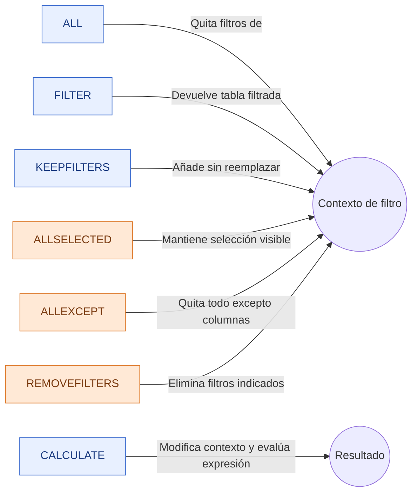

# Filtros DAX – Notas completas con explicaciones, ejemplos y diagramas

## Diagrama general (mapa de funciones)



---

## 1 `ALL`

### Definición

Elimina los filtros del **contexto** sobre la tabla o columna especificada, devolviendo todos los valores posibles de esa tabla/columna.

### Sintaxis

```DAX
ALL( Tabla[Columna] )
ALL( Tabla )
```

### Ejemplos

a) Ignorar el filtro de Año para sumar todas las ventas

```DAX
Ventas Total Sin Filtros =
CALCULATE(
    SUM( Ventas[Importe] ),
    ALL( Ventas[Año] )
)
```

b) Porcentaje sobre el total

```DAX
% del Total =
DIVIDE(
    SUM( Ventas[Importe] ),
    CALCULATE( SUM( Ventas[Importe] ), ALL( Ventas ) )
)
```

## 2 `FILTER`

### Definición

Devuelve una **tabla** que contiene solo las filas que cumplen la condición indicada. Se usa mucho dentro de `CALCULATE` para construir filtros complejos.

### Sintaxis

```DAX
FILTER( Tabla, CondicionFiltrado )
```

### Ejemplos

a) Ventas con importe > 1.000

```DAX
Ventas > 1000 =
CALCULATE(
    SUM( Ventas[Importe] ),
    FILTER( Ventas, Ventas[Importe] > 1000 )
)
```

b) Ventas de productos activos y stock > 0

```DAX
Ventas Productos Activos =
CALCULATE(
    SUM( Ventas[Importe] ),
    FILTER(
        RELATEDTABLE(Productos),
        Productos[Estado] = "Activo" && Productos[Stock] > 0
    )
)
```

## 3) `KEEPFILTERS`

### Definición

Agrega un filtro **sin reemplazar** los existentes; **estrecha** (contrae) el contexto en lugar de sobreescribirlo.

### Sintaxis

```DAX
KEEPFILTERS( Tabla[Columna] = Valor )
```

### Ejemplos

a) El informe ya filtra `Productos[Categoria] = "Electrónica"`; añadimos `Tipo = "Premium"` sin borrar el filtro existente

```DAX
Ventas Electrónica Premium =
CALCULATE(
    SUM( Ventas[Importe] ),
    KEEPFILTERS( Productos[Categoria] = "Electrónica" ),
    KEEPFILTERS( Productos[Tipo] = "Premium" )
)
```

b) Contrastar con filtro directo (que sí reemplaza)

```DAX
Ventas Solo Premium (reemplaza) =
CALCULATE(
    SUM( Ventas[Importe] ),
    Productos[Tipo] = "Premium"  -- Esto puede reemplazar filtros previos sobre esa columna
)
```

## 4) `CALCULATE` y filtros directos

### Definición

`CALCULATE(<expresión>, <modificaciones de contexto>)` **evalúa la expresión** después de **modificar** el contexto de filtro. Los filtros pasados como `Columna = Valor` **reemplazan** el filtro existente de esa columna.

### Sintaxis mínima

```DAX
CALCULATE( <Expresión>, <Filtro1>, <Filtro2>, ... )
```

### Ejemplos

a) Ventas solo de España

```DAX
Ventas España =
CALCULATE(
    SUM( Ventas[Importe] ),
    Ventas[Pais] = "España"
)
```

b) Forzar Año=2023 aunque el visual esté en 2024

```DAX
Ventas 2023 =
CALCULATE(
    SUM( Ventas[Importe] ),
    Ventas[Año] = 2023
)
```

## 5) `ALLSELECTED`

### Definición

Quita filtros internos del modelo pero **mantiene** las selecciones visibles hechas por el usuario (segmentadores). Ideal para ratios dependientes de la selección.

### Sintaxis

```DAX
ALLSELECTED( Tabla | Columna )
```

### Ejemplos

a) Total relativo a categorías seleccionadas

```DAX
Ventas Selección Usuario =
CALCULATE(
    SUM( Ventas[Importe] ),
    ALLSELECTED( Productos[Categoria] )
)
```

b) % sobre el subtotal visible

```DAX
% del Subtotal Visible =
VAR TotalVisible = CALCULATE( SUM(Ventas[Importe]), ALLSELECTED(Productos[Categoria]) )
RETURN DIVIDE( SUM(Ventas[Importe]), TotalVisible )
```

## 6) `ALLEXCEPT`

### Definición

Elimina **todos** los filtros de una tabla **excepto** los de las columnas indicadas.

### Sintaxis

```DAX
ALLEXCEPT( Tabla, Columna1, Columna2, ... )
```

### Ejemplos

a) Ignorar todo excepto País

```DAX
Ventas Solo Respetando País =
CALCULATE(
    SUM( Ventas[Importe] ),
    ALLEXCEPT( Ventas, Ventas[Pais] )
)
```

b) Mantener País y Año, ignorar resto

```DAX
Ventas País-Año =
CALCULATE(
    SUM( Ventas[Importe] ),
    ALLEXCEPT( Ventas, Ventas[Pais], Ventas[Año] )
)
```

## 7) `REMOVEFILTERS`

### Definición

Elimina los filtros de las tablas o columnas especificadas. Semántica clara y moderna; funcionalmente equivalente a quitar filtros como con `ALL` (sobre columnas/tabla) dentro de `CALCULATE`.

### Sintaxis

```DAX
REMOVEFILTERS( Tabla | Columna )
```

### Ejemplos

a) Ignorar filtro del cliente

```DAX
Ventas Ignorando Cliente =
CALCULATE(
    SUM( Ventas[Importe] ),
    REMOVEFILTERS( Clientes[Nombre] )
)
```

b) Quitar todos los filtros de Ventas

```DAX
Ventas Globales =
CALCULATE(
    SUM( Ventas[Importe] ),
    REMOVEFILTERS( Ventas )
)
```

## Notas y buenas prácticas

- Usa `KEEPFILTERS` cuando quieras **sumar** restricciones al contexto sin romper lo que viene del visual.
- Prefiere `REMOVEFILTERS` a `ALL` cuando quieras claridad semántica al quitar filtros dentro de `CALCULATE`.
- Para **porcentajes sobre total**: combinación de `DIVIDE` + `CALCULATE` + `ALL`/`REMOVEFILTERS`.
- Comprueba relaciones y direccionalidad: un `FILTER` sobre tabla relacionada puede requerir `RELATEDTABLE` o aplicar filtros sobre la propia dimensión.